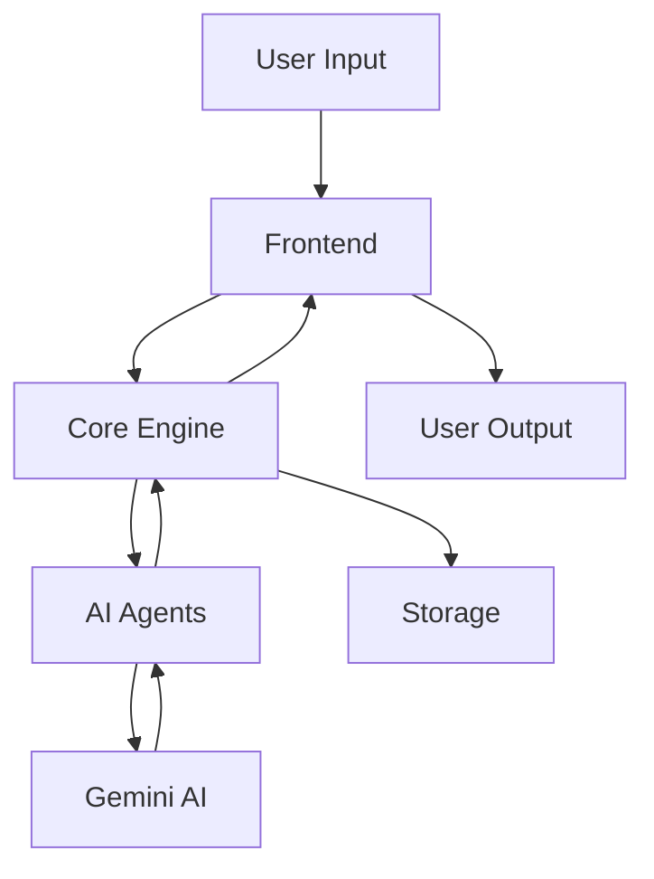

<div align="center">

# 🤖 SCRIBE AI

<p>An Advanced AI-Powered Writing Assistant Built with Gemini AI</p>

[](https://www.python.org/downloads/)
[](https://streamlit.io)
[](https://github.com/psf/black)
[](https://opensource.org/licenses/MIT)
[](https://makeapullrequest.com)
[](https://github.com/yourusername/scribe-ai/graphs/commit-activity)
[](https://scribe-ai.readthedocs.io/en/latest/?badge=latest)
[](https://hub.docker.com/r/sapienskid/scribe-ai/)
[](https://codecov.io/gh/sapienskid/scribe-ai)

[Live Demo](https://your-demo-link.com) • [Documentation](docs/README.md) • [API Reference](docs/API.md) • [Contributing](CONTRIBUTING.md) • [Report Bug](https://github.com/yourusername/scribe-ai/issues)


</div>

## 📚 Table of Contents

- [Overview](#-overview)
- [Features](#-features)
- [System Requirements](#-system-requirements)
- [Installation](#-installation)
- [Architecture](#-architecture)
- [Development](#-development)
- [Testing](#-testing)
- [Deployment](#-deployment)
- [Configuration](#-configuration)
- [Contributing](#-contributing)
- [Troubleshooting](#-troubleshooting)
- [License](#-license)
- [Support](#-support)

## 📌 Overview

SCRIBE AI is a sophisticated writing assistant that leverages Google's Gemini AI to revolutionize content creation. Built with Python and Streamlit, it offers a powerful suite of tools for content generation, research automation, and performance analytics.

### Why SCRIBE AI?

- 🚀 **Efficiency**: Reduce content creation time by up to 60%
- 🎯 **Accuracy**: AI-powered research and fact-checking
- 🔍 **SEO Optimization**: Built-in SEO tools and analysis
- 🌐 **Multilingual**: Support for 50+ languages
- 🛠 **Customization**: Adaptable to various content types and styles

## ✨ Features

### Content Creation
- **Multi-Format Content Generation**
  - Blog posts and articles
  - Social media content
  - Marketing copy
  - Technical documentation
  - Email newsletters
  - Product descriptions
  - Academic papers
  
- **Advanced Writing Tools**
  - Style customization
  - Tone adjustment
  - Grammar checking
  - Readability analysis
  - Plagiarism detection
  - Citation management
  - Version control

### Research & Analysis
- **Automated Research**
  - Web scraping integration
  - Academic paper analysis
  - Data aggregation
  - Source verification
  - Citation generation

- **Content Analytics**
  - Readability scores
  - SEO performance
  - Engagement predictions
  - Trend analysis
  - Performance tracking

### Technical Features
- **Security**
  - End-to-end encryption
  - Secure content storage
  - Rate limiting
  - API key management
  - User authentication

- **Integration Capabilities**
  - REST API
  - Webhook support
  - Custom plugin system
  - Export capabilities

## 💻 System Requirements

### Minimum Requirements
- Python 3.8+
- 4GB RAM
- 2GB free disk space
- Internet connection

### Recommended Specifications
- Python 3.10+
- 8GB RAM
- 5GB free disk space
- High-speed internet connection

### Supported Platforms
- Linux (Ubuntu 20.04+, CentOS 8+)
- macOS (10.15+)
- Windows 10/11

## 🚀 Installation

### Quick Installation

```bash
# Clone repository
git clone https://github.com/yourusername/scribe-ai.git
cd scribe-ai

# Create virtual environment
python -m venv .venv
source .venv/bin/activate  # Unix
.venv\Scripts\activate     # Windows

# Install dependencies
pip install -e ".[dev]"

# Configure environment
cp .env.example .env
# Edit .env with your settings

# Run application
streamlit run scribe_ai/frontend/app.py
```

### Detailed Installation Steps

1. **Clone Repository**
   ```bash
   git clone https://github.com/yourusername/scribe-ai.git
   cd scribe-ai
   ```

2. **Set Up Python Environment**
   ```bash
   # Create virtual environment
   python -m venv .venv
   
   # Activate virtual environment
   # Unix/macOS:
   source .venv/bin/activate
   # Windows:
   .venv\Scripts\activate
   
   # Upgrade pip
   python -m pip install --upgrade pip
   ```

3. **Install Dependencies**
   ```bash
   # Install main package
   pip install -e ".[dev]"
   
   # Install pre-commit hooks
   pre-commit install
   ```

4. **Configure Environment**
   ```bash
   # Copy example environment file
   cp .env.example .env
   
   # Edit .env with your settings:
   # - GEMINI_API_KEY
   # - CONTENT_STORAGE_PATH
   # - Other configuration options
   ```

5. **Initialize Database**
   ```bash
   python scripts/init_db.py
   ```

6. **Run Application**
   ```bash
   streamlit run scribe_ai/frontend/app.py
   ```

## Dependencies

```bash
streamlit
google-generativeai
python-dotenv
asyncio
aiohttp
nest_asyncio
beautifulsoup4
markdown2
cryptography
pyperclip
textstat
newspaper3k
lxml_html_clean
scholarly
```

## 🏗 Architecture

### System Components

```plaintext
scribe-ai/
├── scribe_ai/                      # Main package directory
│   ├── __init__.py                # Package initialization
│   ├── agents/                    # AI Agents module
│   │   ├── __init__.py
│   │   ├── base.py               # Base agent class
│   │   ├── content.py            # Content generation agent
│   │   ├── newsletter.py         # Newsletter specific agent
│   │   └── optimization.py       # Content optimization agent
│   │   └── configs/              # Agent configurations
│   │       ├── content_types.yaml
│   │       ├── platforms.yaml
│   │       ├── prompts.yaml
│   │       └── writing_styles.yaml
│   ├── core/                      # Core business logic
│   │   ├── __init__.py
│   │   ├── content_generator.py   # Content generation logic
│   │   ├── research.py           # Research automation
│   │   └── analyzer.py           # Content analysis
│   ├── frontend/                  # Streamlit UI
│   │   ├── __init__.py
│   │   ├── app.py                # Main Streamlit application
│   │   ├── components/           # Reusable UI components
│   │   │   ├── __init__.py
│   │   │   ├── header.py
│   │   │   ├── sidebar.py
│   │   │   └── content_editor.py
│   │   └── pages/                # Application pages
│   │       ├── __init__.py
│   │       ├── content_creation.py
│   │       ├── history.py
│   │       └── settings.py
│   └── utils/                     # Utility functions
│       ├── __init__.py
│       ├── config.py             # Configuration management
│       ├── storage.py            # Local storage handling
│       └── text_processing.py    # Text processing utilities
├── tests/                         # Test suite
│   ├── __init__.py
│   ├── conftest.py               # Test configuration
│   ├── test_agents/              # Agent tests
│   ├── test_core/                # Core logic tests
│   └── test_utils/               # Utility tests
├── deployment/                    # Deployment configurations
│   ├── Dockerfile
│   ├── docker-compose.yml
│   └── streamlit_config.toml
├── docs/                         # Documentation
│   ├── README.md
│   ├── CONTRIBUTING.md
│   └── DEPLOYMENT.md
├── .gitignore
├── .pre-commit-config.yaml
├── pyproject.toml
└── README.md
```

### Data Flow




## 💻 Development

### Setup Development Environment

```bash
# Install development dependencies
pip install -e ".[dev]"

# Install pre-commit hooks
pre-commit install

# Run code formatters
black scribe_ai
ruff check scribe_ai --fix

# Run type checker
mypy scribe_ai
```

### Code Style Guide

- Follow PEP 8 guidelines
- Use type hints
- Write docstrings (Google style)
- Keep functions focused and small
- Use meaningful variable names

### Git Workflow

1. Create feature branch
   ```bash
   git checkout -b feature/your-feature
   ```

2. Make changes and commit
   ```bash
   git add .
   git commit -m "feat: add amazing feature"
   ```

3. Push changes
   ```bash
   git push origin feature/your-feature
   ```

4. Create Pull Request

## 🧪 Testing

### Running Tests

```bash
# Run all tests
pytest

# Run specific test file
pytest tests/test_core/test_content_generator.py

# Run with coverage
pytest --cov=scribe_ai tests/

# Generate coverage report
coverage html
```

### Test Categories

- Unit Tests
- Integration Tests
- End-to-End Tests
- Performance Tests

## 📦 Deployment

### Docker Deployment

```bash
# Build image
docker build -t scribe-ai .

# Run container
docker run -p 8501:8501 \
    -e GEMINI_API_KEY=${GEMINI_API_KEY} \
    -v $(pwd)/data:/app/data \
    scribe-ai
```

### Docker Compose

```yaml
version: '3.8'
services:
  web:
    build: .
    ports:
      - "8501:8501"
    environment:
      - GEMINI_API_KEY=${GEMINI_API_KEY}
    volumes:
      - ./data:/app/data
```

### Cloud Deployment

#### Streamlit Cloud
1. Connect GitHub repository
2. Select `scribe_ai/frontend/app.py`
3. Configure environment variables
4. Deploy

#### AWS Deployment
Detailed AWS deployment guide available in [DEPLOYMENT.md](docs/DEPLOYMENT.md)

## ⚙️ Configuration

### Environment Variables

```env
# Required
GEMINI_API_KEY=your_api_key_here

# Optional
STREAMLIT_THEME_PRIMARY_COLOR="#FF4B4B"
CONTENT_STORAGE_PATH="./data/content"
LOG_LEVEL="INFO"
MAX_TOKENS=2000
RATE_LIMIT=100
```

### Configuration Files

#### streamlit_config.toml
```toml
[theme]
primaryColor = "#FF4B4B"
backgroundColor = "#FFFFFF"
secondaryBackgroundColor = "#F0F2F6"
textColor = "#262730"

[server]
port = 8501
enableCORS = false
```

## 🤝 Contributing

We welcome contributions! Please see our [Contributing Guide](CONTRIBUTING.md) for details.

### Getting Started
1. Fork repository
2. Create feature branch
3. Make changes
4. Submit Pull Request

### Guidelines
- Follow code style
- Add tests for new features
- Update documentation
- Keep commits atomic

## 🔧 Troubleshooting

### Common Issues

<details>
<summary>Installation Errors</summary>

- **Error**: `Package not found`
  - Solution: Upgrade pip and try again
  
- **Error**: `Dependencies conflict`
  - Solution: Create fresh virtual environment
</details>

<details>
<summary>Runtime Errors</summary>

- **Error**: `API Key Invalid`
  - Solution: Check .env configuration
  
- **Error**: `Memory Error`
  - Solution: Increase available RAM
</details>

## 📝 License

This project is licensed under the MIT License - see the [LICENSE](LICENSE) file for details.

## 📬 Support

- 📧 Email: support@scribe-ai.com
- 💬 [Discord Community](https://discord.gg/your-server)
- 🐛 [Issue Tracker](https://github.com/yourusername/scribe-ai/issues)
- 📖 [Documentation](https://scribe-ai.readthedocs.io)

---

<div align="center">

Made with ❤️ by Sabin Pokharel

[⬆ Back to Top](#-scribe-ai)

</div>